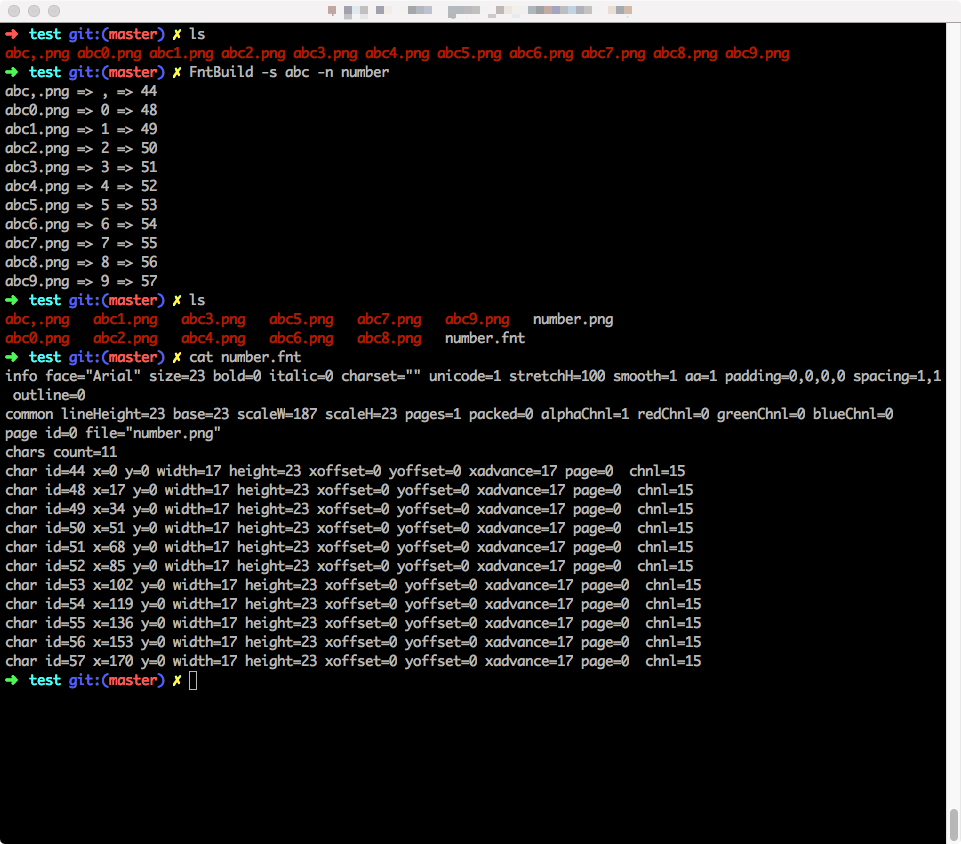

FntBuild
--------------

把几个图片合成一个fnt文件

图片名字命名为对应fnt中的字

如：1.png, 2.png, 3.png, 倍.png

直接运行./FntBuild 就可以生成出fnt文件。

有时候图片有一些前缀或者后缀

如：test_1.png, test_2.png, test_3.png, test_倍.png

这时候运行命令加上-s参数，会在里面去掉-s参数指定的字符串

./FntBuild -s test_ 
